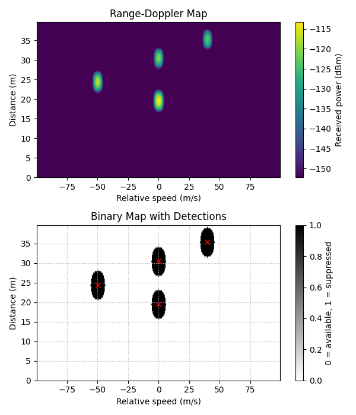

#  OFDM Radar Simulation

A Python-based simulation framework for **OFDM radar**, focusing on **range–Doppler estimation, detection, and performance evaluation**.  
This project is inspired by modern research in **Joint Sensing and Communication (JSC)** and follows signal processing principles from Martin Braun’s thesis [1].

---

## Motivation

Future wireless systems (5G/6G) aim to integrate **communication and sensing** into a unified framework, enabling applications such as:

- Autonomous driving  
- Smart environments  
- Wireless localization  

OFDM is a strong candidate since it is widely used in communication systems and can also support **radar sensing**.

---

## What This Project Does

This project implements an **end-to-end OFDM radar pipeline**, including:

-  OFDM signal generation (modulation, IFFT, CP)  
-  Target modeling (range, velocity, RCS)  
-  Signal reception with noise and channel effects  
-  Demodulation and channel division  
-  Range–Doppler map (2D periodogram)  
-  Target detection (threshold / Pfa-based)  
-  Estimated distance error evaluation as a function of varying bandwidth
-  Estimated speed error evaluation as a function of varying number of OFDM symbols 

---

## Project Structure

```bash
ofdm-radar/
│
├── simulation.py
├── bw_evaluation.py
├── sym_evaluation.py
├── configs/
│   └── simulation_parameters.yaml
│   └── evaluation_parameters.yaml
│
├── src/
│   ├── transmitter.py
│   ├── receiver.py
│   ├── environment.py
│   ├── post_processing.py
│   ├── utils.py
│   └── __init__.py
│
└── results/
    └── 2D_periodogram.png
    └── 3D_periodogram.png
    └── BW_evaluation.png
    └── SYM_evaluation.png
```

## Example Output



---

## How to Run

```bash
python -m venv .venv
source .venv/bin/activate   # Windows: .venv\Scripts\activate
pip install -r requirements.txt
python simulation.py
```

## Reference

[1] M. Braun, *OFDM Radar Algorithms in Mobile Communication Networks*,  
Ph.D. dissertation, Karlsruhe Institute of Technology (KIT), Karlsruhe, Germany, 2014.

